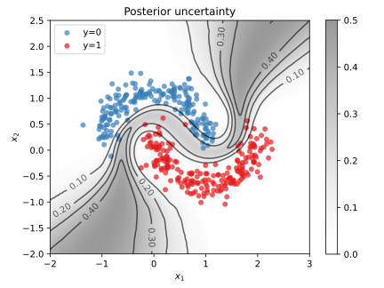

# Variational Bayesian inference with PyTorch

  
  

This project establishes a toolbox for variational Bayesian inference with PyTorch.
For the moment, the focus is on Bayesian neural networks for classification problems.
Multivariate Gaussians with diagonal covariances are used as variational distributions.
More general posterior approximations will be integrated in the future, though.
Demonstrations are provided on the basis of half-moons data and the MNIST dataset.

