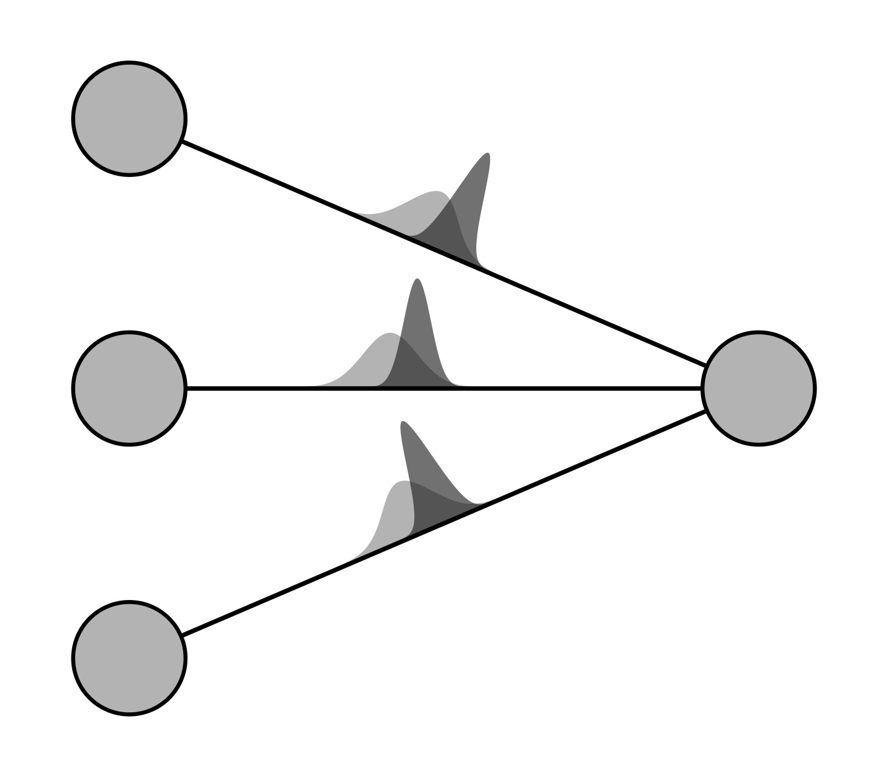

# Variational inference for Bayesian neural nets

<p float="left">
  
  
</p>

This project implements variational inference for Bayesian neural networks with PyTorch.
While the computational expense is expected to increase in comparison to classical model training,
the approach enables a means of uncertainty quantification in deep learning.
Only classification problems can be addressed at this point.
Another limitation is that the variational distribution, which acts as a parametric posterior approximation,
is restricted to a multivariate Gaussian with a diagonal covariance matrix.


## Installation

```
pip install -e .
```

